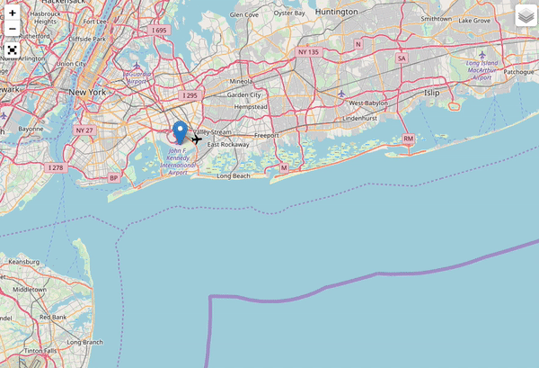
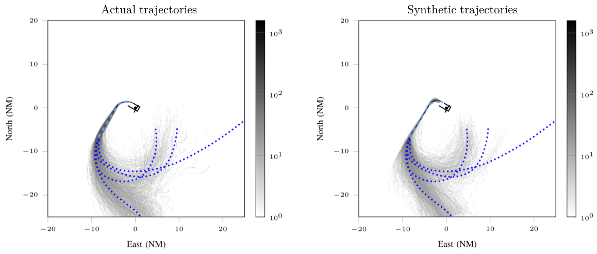

# Air Traffic Modeling in Terminal Airspace

This repository contains an aircraft trajectory learning algorithm used for the terminal airspace modeling project.

  
  
  


## Scripts (Description & Usage)
-i : input files  
-o : output files


* **model_train.py** : learns the deviations of trajectories from procedures, distance vs. transit time, inter arrival-departure times
```bash
python3 src/model_train.py -i data/radar_data.csv data/train_input.json 
    -o output/model.json
```

* **model_generate.py** : generates synthetic trajectories using trained deviations and test inputs
```bash
python3 src/model_generate.py -i output/model.json data/test_input.json 
    -o output/synthetic_trajs.csv
```

* **radar_animate.py** : animates actual/synthetic trajectories 
```bash
python3 src/radar_animate.py -i output/synthetic_trajs.csv data/test_input.json output/animation.html
```

* **radar_plot.py** : draws different kinds of plots of actual/synthetic trajectories (log-'hist'ogram, 'all' trajectories, 'each' trajectory)
```bash
python3 src/radar_plot.py -i output/synthetic_trajs.csv data/test_input.json hist
```


## Input & Output files (Description)

* **CSV files** (radar_data.csv, synthetic_trajs.csv)
  - Input and output trajectory data are in **CSV** format.
  - Each row is a ENU position of an aircraft from the airport  
    : **[time(seconds), track_id, x(meters), y(meters), z(meters)]**
  

* **JSON files** (train_input.json, test_intput.json)
  - Airport runway and procedural information are given as input in **JSON** format.
  - Each row of runway/path coordinates is a point in runway/path  
    : **[latitude(degree), longitude(degree), altitude(feet)]**
  - Path weights are the fraction of each path taken by actual trajectories. 


