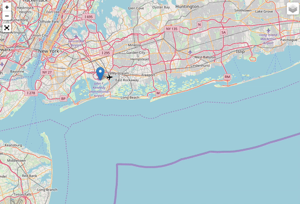

# Air Traffic Modeling in Terminal Airspace

This repository contains an aircraft trajectory learning algorithm used for the terminal airspace modeling project.




## Description & Usage

* **model_train.py** : learns the deviations of trajectories from procedures, distance vs. transit time, inter arrival-departure times
```bash
python3 src/model_train.py -i data/radar_data.csv data/train_input.json 
    -o output/model.json -mp 4
```

* **model_generate.py** : generates synthetic trajectories using trained deviations and test inputs
```bash
python3 src/model_generate.py -i output/model.json data/test_input.json 
    -o output/synthetic_trajs.csv -mp 4
```

* **radar_animate.py** : animates actual/synthetic trajectories 
```bash
python3 src/radar_animate.py -i output/synthetic_trajs.csv data/test_input.json output/animation.html
```

* **radar_plot.py** : draws different kinds of plots of actual/synthetic trajectories (log-'hist'ogram, 'all' trajectories, 'each' trajectory)
```bash
python3 src/radar_plot.py -i output/synthetic_trajs.csv data/test_input.json hist
```


## Data format & Example files
All input and output trajectory data should be in .csv format, where each row is a position of an aircraft [time, track_id, x, y, z].
Airport and procedure information should be in .json format and given as input.
Example files are in /data directory.


